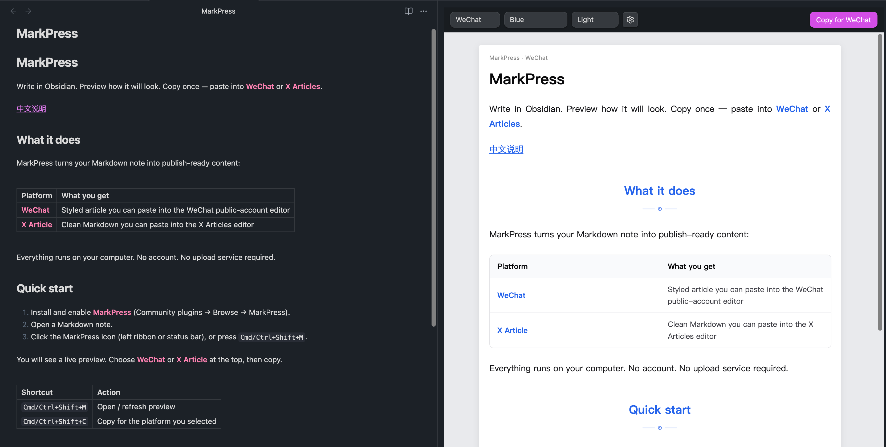
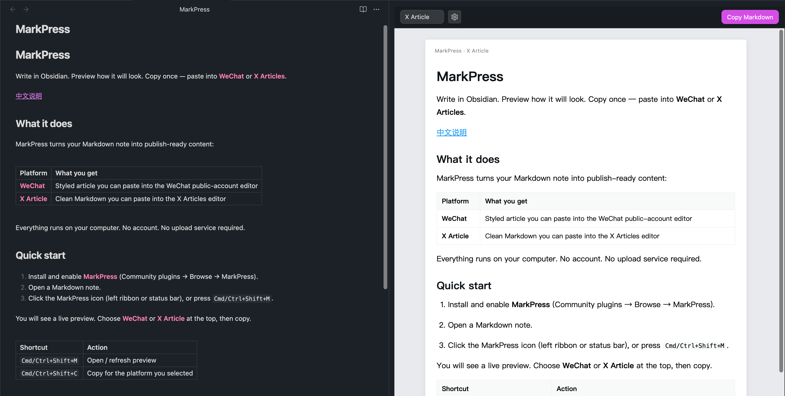

# MarkPress

在 Obsidian 里写好文章，预览效果，一键复制——粘贴到 **微信公众号** 或 **X Articles**。

[English](./README.md)

## 它能做什么

把你的 Markdown 笔记变成可直接发布的内容：

| 平台 | 你会得到 |
| --- | --- |
| **微信公众号** | 带排版样式的文章，粘贴进公众号后台即可 |
| **X Article** | 干净的 Markdown，粘贴进 X 长文编辑器即可 |

全程在本地完成，不用注册账号，也不必把笔记上传到任何服务。

## 快速开始

1. 安装并启用 **MarkPress**（设置 → 第三方插件 → 浏览 → 搜索 MarkPress）。
2. 打开一篇 Markdown 笔记。
3. 点击左侧或底部的 MarkPress 图标，或按 `Cmd/Ctrl+Shift+M`。

右侧会出现预览。顶部选择 **WeChat** 或 **X Article**，再点复制。

| 快捷键 | 作用 |
| --- | --- |
| `Cmd/Ctrl+Shift+M` | 打开 / 刷新预览 |
| `Cmd/Ctrl+Shift+C` | 按当前选择的平台复制 |

## 发到微信公众号

1. 预览栏选择 **WeChat**。
2. 需要的话选一个主题，以及浅色 / 深色。
3. 点击 **Copy for WeChat**。
4. 打开微信公众号后台编辑器，粘贴（`Cmd/Ctrl+V`）。

笔记里的图片一般会一起复制进去。

**提示：** 发布到微信时，浅色模式通常更接近读者最终看到的效果。

## 发到 X Articles

1. 预览栏选择 **X Article**。
2. 点击 **Copy Markdown**。
3. 粘贴到 X 的 Articles 编辑器。

**关于图片：** X 不能像微信那样直接带走库里的本地图片。网上的图片链接（`https://...`）可以保留；只存在 Obsidian 库里的图，粘贴后请在 X 里重新上传，或如果你本来就有图床，可在 MarkPress 设置里填写图片地址前缀。

## 其他说明

- 支持标题、加粗、列表、引用、表格、代码块、Obsidian Callout。
- 支持 `![[图片.png]]` 这种 Wiki 图片写法。
- 默认平台、主题等可在 **设置 → MarkPress** 里改。

## 隐私

MarkPress 在本地运行，不会把笔记发到服务器。只有你点击「复制」时，才会写入系统剪贴板。

给审核用的完整说明：[docs/disclosures.md](./docs/disclosures.md) · [SECURITY.md](./SECURITY.md)

## 更多

- [进阶选项](./docs/advanced.md) — 单篇主题覆盖、X 图床前缀、开发构建
- [更新日志](./CHANGELOG.md) — 版本历史
- [插件上架说明](./PUBLISHING.md) — 维护者提交社区插件时用
- [截图规范](./images/README.md) — README 配图命名与尺寸

## 许可

[MIT](./LICENSE) · 作者：[Kong](https://github.com/kong0xyz)
